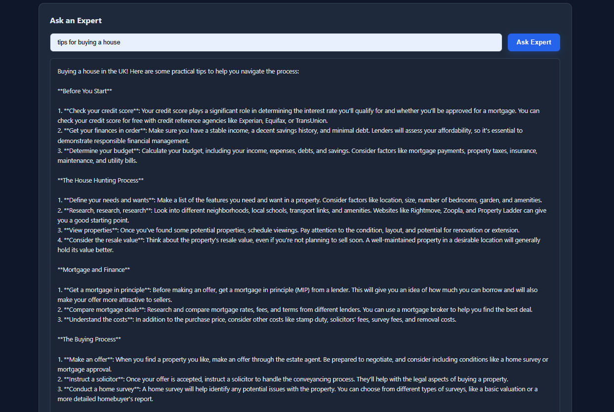
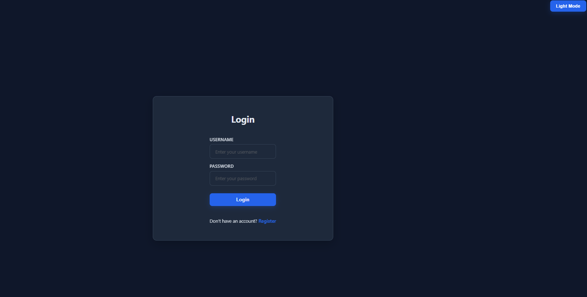

# House Finder

A web application designed to simplify the process of finding and tracking properties on Rightmove. Search properties, manage requirements, save shortlists, and get expert advice on house buying in the UK.

## Features





### Core Features (Completed)
- **Property Search** — Search Rightmove listings by URL and view result counts
- **User Authentication** — Register and login with secure password hashing
- **Search History** — Track your searches over time in a persistent history
- **Requirements Tracker** — Create and manage a checklist of must-haves for your property search
- **Shortlist Manager** — Save and organize properties you're interested in
- **Expert Chat** — Ask questions about house buying and get AI-powered advice from a real estate expert
- **Dark/Light Mode** — Toggle between dark and light themes for comfortable browsing
- **Responsive Design** — Works seamlessly on desktop, tablet, and mobile devices

### Technical Features
- Secure JWT-based authentication
- SQLite database for user persistence
- CORS-enabled API backend
- Real-time form validation
- Auto-clearing success/error messages

## Tech Stack

**Frontend:**
- HTML5, CSS3, JavaScript (vanilla)
- Responsive design with CSS variables

**Backend:**
- Python Flask framework
- Flask-SQLAlchemy for database ORM
- PyJWT for authentication tokens
- Werkzeug for password hashing
- Beautiful Soup for web scraping
- Groq AI API for expert chatbot

**Database:**
- SQLite (development)

## Installation

### Prerequisites
- Python 3.8+ (for local development)
- Node.js (optional, for running locally)

### Project Structure

The project is structured for Netlify deployment:
```
├── netlify/
│   └── functions/          # Serverless functions (converted from Flask routes)
│       ├── utils.py        # Shared utilities
│       ├── register.py     # User registration
│       ├── login.py        # User authentication
│       ├── verify_token.py # Token verification
│       ├── scrape.py       # Property scraping
│       ├── history.py      # Search history
│       ├── requirements.py # Requirements management
│       ├── shortlist.py    # Shortlist management
│       ├── geocode.py      # Geocoding service
│       ├── ask_expert.py   # AI expert chat
│       └── init_db.py      # Database initialization
├── public/                 # Static files (served by Netlify)
│   ├── index.html
│   ├── style.css
│   ├── script.js
│   └── logo.png
├── netlify.toml            # Netlify configuration
├── requirements.txt        # Python dependencies
└── app.py                  # Original Flask app (for local dev)
```

### Local Development Setup

1. Clone the repository
```bash
git clone <repo-url>
cd house-finder-v1
```

2. Install Python dependencies
```bash
pip install -r requirements.txt
```

3. Create a `.env` file in the project root
```
SECRET_KEY=your-secret-key-here
GROQ_API_KEY=your-groq-api-key
TURSO_AUTH_TOKEN=your-turso-token
TURSO_DATABASE_URL=libsql://your-database-url
```

4. Initialize the database (run once)
```bash
python netlify/functions/init_db.py
```

5. Run the Flask server for local development
```bash
python app.py
```

The backend will be available at `http://127.0.0.1:5000`

6. For frontend, open `public/index.html` in a web browser, or serve it:
```bash
cd public
python -m http.server 8000
```

Then visit `http://localhost:8000` (the frontend will automatically use the Flask backend when running locally)

### Netlify Deployment

1. **Push your code to GitHub/GitLab/Bitbucket**

2. **Connect to Netlify:**
   - Go to [Netlify](https://www.netlify.com)
   - Click "New site from Git"
   - Connect your repository

3. **Configure build settings:**
   - **Build command:** Leave empty (static site)
   - **Publish directory:** `public`
   - **Functions directory:** `netlify/functions`

4. **Set environment variables in Netlify:**
   - Go to Site settings > Environment variables
   - Add the following:
     - `SECRET_KEY` - Your JWT secret key (min 32 characters)
     - `GROQ_API_KEY` - Your Groq API key
     - `TURSO_AUTH_TOKEN` - Your Turso database auth token
     - `TURSO_DATABASE_URL` - Your Turso database URL (libsql://...)

5. **Deploy:**
   - Netlify will automatically build and deploy your site
   - Functions will be available at `/.netlify/functions/{function-name}`
   - The frontend will automatically use Netlify Functions in production

6. **Initialize Database (one-time):**
   - After first deployment, you can create a one-time function to initialize the database
   - Or run the init script manually via Netlify CLI:
   ```bash
   netlify functions:invoke init_db
   ```

## Project Roadmap

### Stage 1: Core Functionality ✅
- [x] UI/UX design and layout
- [x] Property search functionality
- [x] Search result display
- [x] Search history tracking
- [x] Requirements checklist
- [x] Shortlist feature

### Stage 2: Enhanced Features (In Progress)
- [ ] Save favorite filter combinations
- [ ] Filter presets for quick searches
- [ ] Comparison tool for properties

### Stage 3: User System ✅
- [x] User registration and login
- [x] Secure authentication with JWT
- [x] User profile management
- [x] Persistent user data

### Stage 4: AI Assistant ✅
- [x] Expert chatbot for house buying advice
- [x] Real estate knowledge base
- [x] Question and answer interface

## Usage

### Searching Properties
1. Log in or register an account
2. Paste a Rightmove search URL into the search bar
3. Click "Get Results" to fetch property counts
4. View your search history below the results

### Managing Requirements
1. Click "Add a Requirement" to create a new checklist item
2. Check off requirements as you find matching properties
3. Requirements are automatically saved

### Using the Shortlist
1. Click "Add to Shortlist" to save properties
2. Name each shortlisted property for reference
3. Your shortlist persists between sessions

### Asking the Expert
1. Navigate to the "Ask an Expert" section
2. Type your question about house buying in the UK
3. Receive AI-powered advice from a real estate expert

### Switching Themes
Click the "Light Mode" or "Dark Mode" button in the top-right corner

## API Endpoints

### Authentication
- `POST /register` — Create a new user account
- `POST /login` — Authenticate and receive JWT token
- `GET /verify_token` — Validate JWT token

### Search
- `GET /scrape?url=<url>` — Scrape Rightmove results
- `GET /history` — Retrieve search history

### Expert
- `POST /ask_expert` — Submit question to AI chatbot

## Environment Variables

```
SECRET_KEY          # Random secret key for JWT signing (min 32 chars)
GROQ_API_KEY        # API key from Groq for AI chatbot
```

## Known Limitations

- Requires valid Rightmove URLs for property searches
- Search results depend on Rightmove's HTML structure (may break if Rightmove changes layout)
- AI expert responses limited by Groq API rate limits
- SQLite suitable for development; use PostgreSQL for production

## Future Improvements

- Property price tracking over time
- Email notifications for price drops
- Advanced filtering by location, price, bedrooms
- Integration with other property sites
- Mobile app version
- Saved search alerts
- Data for Crime Rates/Good Schools/Noise Levels

## License

MIT License

## Support

For issues or questions, please open an issue on the project repository.
