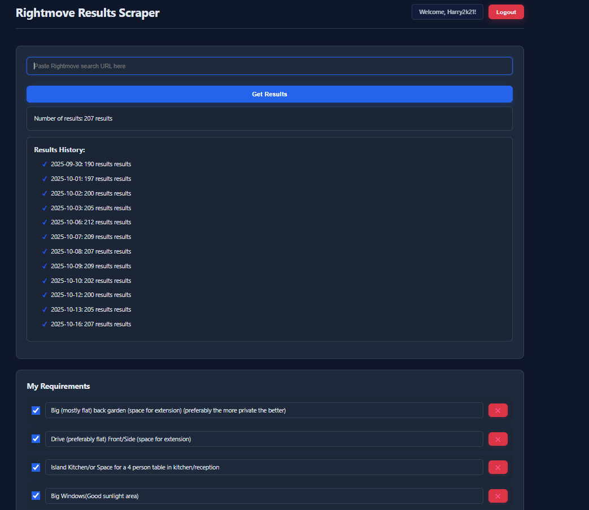
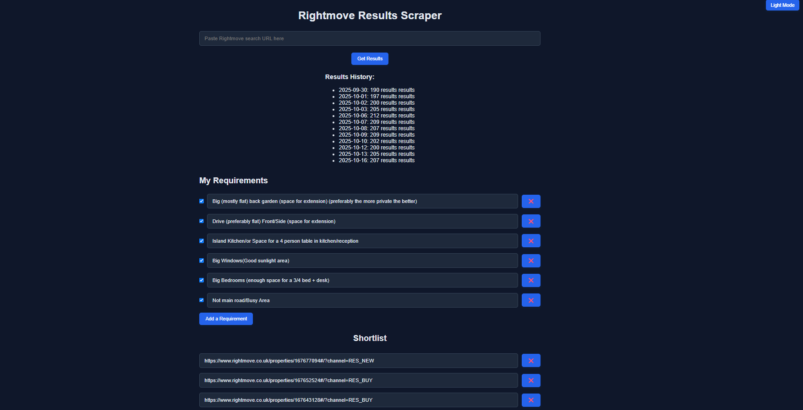

## Project Scope - To make finding a house easier

## Checklist - Draw out how the app is going to look like, 
Create UI, Create main search functionality, Create main filter setting, Make Images come through the API, Make house price come through the API,

## Stage 2 - Make saving favourite filters a feature, 

## Stage 3 - Login Page, Database for Users

## Stage 4 - Make a chatbot that can answer questions about buying a house

